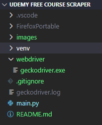

<!-- ABOUT THE PROJECT -->

# About The Project

![Scraper tag][product-screenshot]

This python script do:

- scraping of udemy's free courses page
- choose your preferred language
- save results to a CSV file

This is a console program that extracts all free courses in [Udemy's free courses page](https://www.udemy.com/courses/free/). The final deliverable artifact is a CSV file containing links to each course and other relevant information about it.

The application has a idiom selector that allows to extract free courses in different spoken languages.

## Built With

- [Python](https://www.python.org)
- [Selenium WebDriver](https://www.selenium.dev)
- [Pandas](https://pandas.pydata.org)

## Prerequisites

This application requires the following software components:

- Python (I recommend install as a virtual environment).

  To install Python follow instructions at https://www.python.org. After Python installation on your system run these commands in the project folder :

  ```sh
  pip install virtualenv
  virtualenv venv
  ./venv/Scripts/activate
  ```

  Install these Python librarys on your system or virtual environment:

- Selenium

  ```sh
  pip install selenium

  ```

- Pandas

  ```sh
  pip install pandas
  ```

- Langcodes (required for idiom selector feature)
  ```sh
  pip install selenium
  ```

### Firefox portable

I configured a portable firefox browser inside project folder. If you want to use it too follow these steps:

1. Download firefox portable following this link in [PortableApps.com](https://portableapps.com/apps/internet/firefox_portable) website.
2. Install with the default settings just taking care to install into the project folder (folder that you installed the Udemy Free Courses scraper)

After these installations your project folder will look like this:



In case you don't want use portable firefox change this section of the code in main.py program file:

```python
# comment firefox_binary
#firefox_binary = FirefoxBinary(r"{0}/FirefoxPortable/App/Firefox64/firefox.exe".format(os.getcwd()))
# change driver initialization, removing firefox_binary=firefox_binary argument
driver = webdriver.Firefox(executable_path=driver_location, firefox_profile=firefox_profile)
```

## Installation

- See the prerequisites above and clone the repo inside a folder.

```sh
git clone https://github.com/vol-automation/webscraping-udemy_free_courses.git
```

## Usage

- Run this command inside terminal at project folder:

```sh
py main.py
```

<!-- MARKDOWN LINKS & IMAGES -->
<!-- https://www.markdownguide.org/basic-syntax/#reference-style-links -->

[product-screenshot]: images/tag.png
